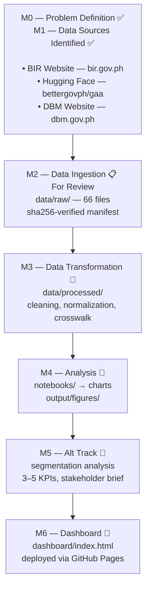

# TaxTracePH

## The Core Problem

We pay taxes every single day. It gets taken out of our paychecks, and it's added to everything we buy, from food and gas to electricity. We contribute our hard-earned money to the national treasury with the simple promise that it will return to our communities in the form of decent roads, working hospitals, and reliable public services.

But if you look around, that promise feels broken. We see tax collection offices boasting about hitting their targets, yet we still navigate potholes, deal with flooded streets, and struggle with neglected public facilities. 

The real problem is that the public has no way to trace the money. The documents showing what citizens pay and the files showing how the government spends are kept completely separate, whether by design or just out of sheer disorganization. Because these pieces of information never meet, we can't see the receipts. We have no way of knowing if the taxes collected from our hometowns are actually spent to improve them, or if the funds are simply lost in bureaucratic black holes.

This project is an effort to change that. I am bringing these scattered pieces of data together into one clear picture, so we can finally track the life cycle of tax money and compare what a region contributes to what it actually gets back. Specifically, this project aims to answer: **Can a consolidated, open data pipeline reveal whether local taxes collected from Philippine regions are being proportionally spent to develop their local communities?**

> The Extensible Challenge

This frustration isn't unique to the Philippines. People in neighboring countries like Indonesia and Malaysia face the exact same lack of transparency. 

But trying to compare how well different governments use their citizens' money is a massive headache. Every country tracks its finances differently, uses its own currency, and labels its regions and taxpayer categories in ways that don't match. To make a fair comparison, I have to do the messy, behind-the-scenes work of translating, aligning, and cleaning up these incompatible records so everyone can look at them side-by-side.

---

## Pipeline Architecture

Below is the current state of the pipeline. Milestones M0 and M1 (problem definition and data source identification) wrap the three data sources together, and M2 is the most recent completed milestone — submitted for review.



### Milestone Status

| Milestone | Status | What it delivers |
|-----------|--------|------------------|
| **M0** | ✅ Complete | Problem statement framed as an answerable question |
| **M1** | ✅ Complete | Data sources identified, documented, and linked in README |
| **M2** | 📋 For Review | `scripts/ingest.py` downloads raw data into `data/raw/` with SHA-256 manifest tracking |
| **M3** | 🔄 In Progress | `scripts/transform.py` cleans, normalizes, and merges datasets into `data/processed/` |
| **M4** | 📅 Not Started | Exploratory notebooks and charts in `output/figures/` |
| **M5** | 📅 Not Started | Segmentation analysis across regions and fiscal phases, 3–5 KPIs with calculation logic and trends, 1-page stakeholder brief |
| **M6** | 📅 Not Started | Live dashboard at a public GitHub Pages URL |

---

## Data Sources

To construct a reliable fiscal map, the pipeline currently ingests data from three Philippine government repositories where each capturing a different phase of the public money lifecycle:

### 1. Revenue Collected — BIR Tax Collection Statistics

The Bureau of Internal Revenue publishes annual and monthly collection summaries on their website. These files show how much tax was collected, broken down by revenue type and collection district.

- **Source**: https://www.bir.gov.ph/collection-statistics
- **Ingested**: 3 Excel files
  - Annual collection summary (PHP 2005–2025)
  - Monthly collection summary (PHP 2016–2025)
  - Monthly collection update (PHP Jan–May 2026)
- **Format**: `.xlsx`

### 2. Budget Authorized — GAA Budget Allocations

The General Appropriations Act dataset, maintained by BetterGov.ph on Hugging Face, records how the national budget is allocated across agencies, regions, and programs. It uses UACS (Unified Accounts Code Structure) codes to tag each appropriation to a specific region and purpose.

- **Source**: https://huggingface.co/datasets/bettergovph/gaa
- **Ingested**: 1 Parquet file (79.7 MB, 4.5M+ rows, 22 columns) + README
- **Format**: `.parquet`

### 3. Actual Spending — DBM SAAODB Reports

The Department of Budget and Management publishes quarterly reports of actual government obligations and disbursements through its Statement of Appropriations, Allotments, Obligations, and Balances (SAAODB). This is the closest you get to "where the money actually went" that's publicly available.

- **Source**: https://www.dbm.gov.ph/index.php/budget
- **Ingested**: 61 files covering FY 2011–2026 Q1
  - 14 `.htm` files (2011 Q1–2014 Q2) — HTML tables
  - 47 `.pdf` files (2014 Q3–2026 Q1) — tabular PDFs
- **Format**: `.htm` (early years), `.pdf` (later years)

### Transnational Extension (Planned)

The pipeline architecture supports adding foreign fiscal data sources by implementing new `BaseExtractor` subclasses. Planned targets:

- Indonesia: https://data.go.id/
- Malaysia: https://data.gov.my/

> **Note on the DBM Fallback Source:**
>
> The original plan listed https://www.dbm.gov.ph/index.php/budget as a fallback in case the primary sources weren't enough. What I found there changed that plan entirely.
>
> The DBM publishes quarterly SAAODB (Statement of Appropriations, Allotments, Obligations, and Balances) reports going back to 2011. BIR tells me how much tax was collected. GAA tells me how much the government planned to spend. But neither answers the real question: did the money actually get spent as intended? SAAODB captures actual obligations and disbursements which is the closest thing to "where the money really went" that's publicly available.
>
> The fallback became a primary source the moment I realized it closed the loop. With all three sources together, I can now trace the full life cycle: revenue collected → budget authorized → funds actually spent.

---

## How the Ingestion Works

The extraction framework is built around a shared `BaseExtractor` abstract class. Each data source gets its own subclass, but they all inherit the same SHA-256 checksum tracking, manifest management, and retry logic. Every downloaded file is recorded in `data/raw/manifest.json` so re-running the pipeline is idempotent — no redundant downloads, no wasted bandwidth.

- **BIR scraping**: Multi-strategy — static HTML parsing, `__NEXT_DATA__` JSON extraction, Next.js stream payload regex, and Selenium headless Chrome as fallback (the BIR site is a Next.js app).
- **DBM scraping**: Static HTML with BeautifulSoup (the DBM site runs WordPress — simpler, no dynamic content).
- **GAA download**: File-by-file using `huggingface_hub` SDK (avoids memory overhead of `datasets.load_dataset()`).

All downloads include exponential backoff with jitter (up to 5 retries) and random rate-limiting delays between requests. Government websites are not built for automated scraping, they serve real citizens browsing during office hours. Hitting them with rapid, repeated requests could overwhelm the server and effectively DDoS it, blocking other people from accessing public information. The delays and backoff spread the traffic out so the pipeline scrapes responsibly.

---

## How to Run the Pipeline

### Prerequisites

- Python 3.12+ and `uv` installed

```bash
# Create and activate the virtual environment
uv venv
source .venv/bin/activate

# Install all dependencies
uv sync
```

### Ingestion (M2)

The ingestion script downloads raw data from one or all of the three data sources. Every download is tracked in `data/raw/manifest.json`. Re-running the script will skip files that are already downloaded and verified.

```bash
# Ingest from all three sources (default)
uv run python scripts/ingest.py

# Ingest from a specific source only
uv run python scripts/ingest.py --source gaa
uv run python scripts/ingest.py --source tax
uv run python scripts/ingest.py --source saaodb

# Ingest from multiple sources
uv run python scripts/ingest.py --source gaa,tax

# Dry run — validate config and connectivity without downloading anything
uv run python scripts/ingest.py --dry-run

# JSON output (useful for CI or scripting)
uv run python scripts/ingest.py --json

# Quiet mode — only log warnings and errors
uv run python scripts/ingest.py --quiet
```

### Transformation (M3)

The transform script is still in development. Once ready, it will read raw files from `data/raw/` and write cleaned, merged output to `data/processed/`.

```bash
uv run python scripts/transform.py
```

---

## Target Audience

This project is built for citizens who want to better understand how local tax contributions connect to public projects in their own neighborhoods. 

It is also designed for local government officials, community organizers, and researchers who want to use clear, data-backed insights to support regional planning and budgeting. Finally, it serves as an open resource for journalists and policy watchdogs looking for objective data to help tell the story of public spending and development.